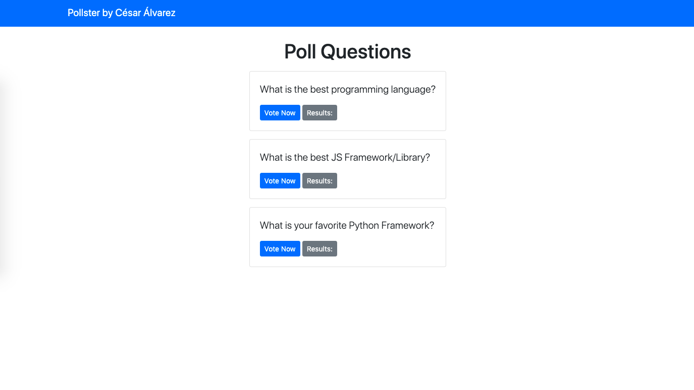
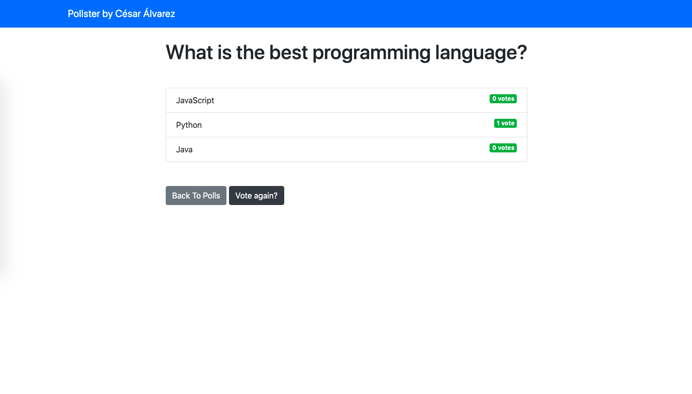

# PollApp-Django
App for doing polls using Django and some Bootstrap for styling




```
# Install dependencies
pipenv install

cd pollster

# Serve on localhost:8000
python manage.py runserver
```
